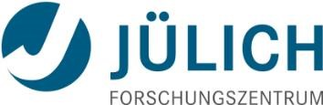

Acknowledgments
===============

We are very grateful for your continuing support for Ptychography 4.0!

Please help us keeping these lists up-to-date and complete! If you feel that you
should be listed here, please contact us. We are grateful for every
contribution, and if your contribution is not listed here we'd like to extend
our apologies and update this as soon as possible.

Creators
~~~~~~~~

The following people in alphabetical order contributed to source code,
documentation, design and management following our :ref:`authorship`.

.. include:: autogenerated/creators.rst

Contributions
~~~~~~~~~~~~~

The following people in alphabetical order contributed to the LiberTEM project
in other ways.

.. include:: autogenerated/contributors.rst

Notable upstream projects
~~~~~~~~~~~~~~~~~~~~~~~~~

`Python <https://www.python.org>`_, `PyData universe <https://pydata.org/>`_,
`Dask.distributed <https://distributed.dask.org/>`_, `PyTorch
<https://pytorch.org/>`_, `NumPy <https://numpy.org/>`_, `OpenBLAS
<https://www.openblas.net/>`_, `Click <https://click.palletsprojects.com/>`_, `Matplotlib
<https://matplotlib.org/>`_, `H5Py
<https://www.h5py.org/>`_, `Numba <https://numba.pydata.org/>`_, `Psutil
<https://psutil.readthedocs.io/>`_, `LiberTEM <https://libertem.github.io/LiberTEM/>`_

Not dependencies, but notable related projects or useful tools: `Hyperspy
<https://hyperspy.org/>`_, `NeXus <https://www.nexusformat.org/>`_,
`Godbolt compiler explorer <https://godbolt.org/>`_, `FIO
<https://github.com/axboe/fio>`_, `pyXem
<https://pyxem.github.io/pyxem-website/>`_

Funding
~~~~~~~

.. |clearfloat|  raw:: html

    

Ptychography 4.0 kindly acknowledges funding and support from the following sources:

Ptychography 4.0
................

.. image:: ./images/Helmholtz-lower.png
    :align: left
    :width: 100px
    :alt: Helmholtz Gemeinschaft Deutscher Forschungszentren

We gratefully acknowledge funding from the `Information & Data Science Pilot
Project
<https://www.helmholtz.de/en/research/information-data-science/information-data-science-pilot-projects/pilot-projects-2/>`_
"Ptychography 4.0" of the Helmholtz Association.

|clearfloat|

ESTEEM3
.......

.. image:: ./images/EU.jpg
    :align: left
    :width: 100px
    :alt: European Union flag

This project has received funding from the European Union's Horizon 2020
research and innovation programme under grant agreement No 823717 – `ESTEEM3
<https://cordis.europa.eu/project/rcn/220936/factsheet/en>`_.

|clearfloat|

moreSTEM
........

.. image:: ./images/Helmholtz.png
    :align: left
    :width: 100px
    :alt: Helmholtz Gemeinschaft Deutscher Forschungszentren

We gratefully acknowledge funding from the `Initiative and Networking Fund of
the Helmholtz Association
<https://www.helmholtz.de/en/about_us/the_association/initiating_and_networking/>`_
within the `Helmholtz Young Investigator Group moreSTEM
<https://morestem.fz-juelich.de/>`_ under Contract No. VH-NG-1317 at
Forschungszentrum Jülich in Germany.

|clearfloat|

Forschungszentrum Jülich, Ernst-Ruska Centrum
.............................................

Forschungszentrum Jülich is supporting Ptychography 4.0 with funding for personnel,
access to its infrastructure and administrative support.

TODO all the other partners
...........................

Lorem ipsum