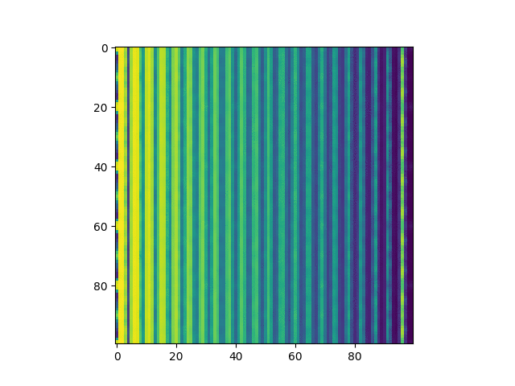

.. _`algorithms`:

Algorithms
==========

Single side band
----------------

The algorithm after :cite:`Pennycook2015` is reformulated to allow incremental
processing using a `LiberTEM user-defined function
<https://libertem.github.io/LiberTEM/udf.html>`_ :cite:`Strauch2021b`. The
notebooks can be downloaded at
https://github.com/Ptychography-4-0/ptychography/tree/master/examples.

   Incremental ptychography animation :cite:`Strauch2021b`.

.. toctree::
   :maxdepth: 2

   algorithms/ssb

Live processing with Quantum Detectors Merlin camera using `LiberTEM-live <https://libertem.github.io/LiberTEM-live/>`_:

.. toctree::
   :maxdepth: 2

   algorithms/live-ssb

Simplified implementation as a reference:

.. toctree::
   :maxdepth: 2

   algorithms/simple-ssb

.. _`iterative`:

Tools for iterative algorithms
------------------------------

Many algorithms for iterative ptychographic reconstruction require the same
basic operations. Ptychography 4.0 offers fast implementations for CPU and GPU
for some of these operations that handle coordinate systems and parameters in a
consistent way.

Transform to reconstruction coordinates
.......................................

Usually, the pixel coordinates of detector and reconstruction grid are not
aligned. In order to calculate an update of the object and probe function, the
recorded detector image has to be transformed to match exactly the forward
model, usually the Fourier transform of the exit wave. Furthermore, real-world
implementations may require an FFT shift or inverse FFT shift to move the zero
frequency to the correct position.

Doing this with :meth:`numpy.fft.fftshift` and :mod:`scipy.ndimage` repeatedly
for a whole dataset can be the rate-limiting step, while keeping an intermediate
transformed version can be memory-consuming. Furthermore, it can be tricky to
get the scaling in physical coordinates right.

Ptychography 4.0 offers a fast implementation that allows to perform the
transformation of detector data to reconstruction coordinates on-the-fly. The
implementation does not perform a precise interpolation, but chooses the nearest
pixel value. If the detector data is scaled down, each pixel in the target area
is filled with the average from the corresponding source area.

The transformation infrastructure consists of three components:

* :meth:`ptychography40.reconstruction.common.diffraction_to_detector` transforms
  coordinates in the reconstruction coordinate system to detector coordinates.
  The parameters of this function correspond to the parameters of
  :class:`ptychography40.reconstruction.ssb.SSB_UDF` and
  :meth:`libertem.api.Context.create_com_analysis`.
* :meth:`ptychography40.reconstruction.common.image_transformation_matrix`
  constructs a sparse matrix that maps a flattened detector image to a flattened
  target image in reconstruction coordinates by applying a function that
  transforms the pixel outlines of the target image to the source coordinates.
  Additionally, it can apply pre- and post-transforms in case the target or
  source coordinates are not euclidean. Most notably, a pre-transform of the
  reconstruction coordinates can apply an inverse FFT shift with zero overhead.
  A post-transform allows flexible mapping of detector positions to detector
  channels, for example to support detectors with nonstandard geometries.
* :meth:`ptychography40.reconstruction.common.apply_matrix` is a convenience
  function that applies a transformation matrix to a stack of detector images,
  taking care of properly reshaping the input and output.

Applying a transformation with this method repeatedly on stacks of images can
achieve excellent performance compared with working on image data using
:mod:`scipy.ndimage` since the matrix has to be calculated only once and can
then be applied with fast implementations for sparse matrix products from
:mod:`scipy.sparse` and :mod:`cupx.scipy.sparse`.

.. testsetup:: transform

    import functools

    import numpy as np

.. testcode:: transform

    from ptychography40.reconstruction.common import (
        diffraction_to_detector, ifftshift_coords,
        image_transformation_matrix, apply_matrix
    )

    data_shape = (3, 8, 8)
    data = np.random.random(data_shape)
    source_shape = (8, 8)
    target_shape = (4, 4)

    f = functools.partial(
        diffraction_to_detector,
        lamb=1,
        diffraction_shape=target_shape,
        pixel_size_real=1,
        # Detector is 2x finer than required
        pixel_size_detector=(1/8, 1/8),
        cy=source_shape[0] / 2,
        cx=source_shape[1] / 2,
        flip_y=True,
        scan_rotation=90.
    )

    m = image_transformation_matrix(
        source_shape=source_shape,
        target_shape=target_shape,
        # swap y and x (transpose) and scale up
        # Transformation goes backwards, from target to source
        affine_transformation=f,
        pre_transform=lambda x: ifftshift_coords(x, target_shape)
    )

    res = apply_matrix(data, m, target_shape)

In this particular example this is equivalent to the following:

.. testcode:: transform

    # Binning, not accumulating intensity but keeping same absolute values
    binned = data.reshape(
        (data.shape[0], target_shape[0], 2, target_shape[1], 2)
    ).mean(axis=(2, 4))
    # flip_y + scan_rotation=90 is equivalent to transposing
    transposed = np.transpose(binned, (0, 2, 1))
    ref = np.fft.ifftshift(transposed, axes=(1, 2))

    assert np.allclose(ref, res)

Shifted products and shifted aggregation
........................................

Ptychography can often be performed with a relatively small illumination
function that is mapped across a larger object function since the illumination
is usually limited in size. That means the forward calculation can be performed
efficiently by slicing out the appropriate portion of the object function,
obtaining the exit wave with a product, calculating the update function and then
applying it back to the object function at the correct place.

Since the reconstruction can be performed with rather small illumination
functions, for example shape :code:`(32, 32)`, an efficient Python
implementation should calculate and apply many updates in a batch.
:meth:`ptychography40.reconstruction.common.rolled_object_probe_product_cpu` and
:meth:`ptychography40.reconstruction.common.rolled_object_probe_product_cuda`
calculate a stack of cropped, shifted and rolled products.
:meth:`ptychography40.reconstruction.common.rolled_object_aggregation_cpu` and
:meth:`ptychography40.reconstruction.common.rolled_object_aggregation_cuda`
accumulate a stack of shifted updates.

The function to calculate products also supports subpixel shifts if an array of
illuminations with subpixel shifts is supplied. Finer resolution than the
reconstruction grid can be supported for the scan coordinates that way.
:meth:`ptychography40.reconstruction.common.rolled_object_probe_product_cpu`
returns the index of the subpixel-shifted probe for each product so that the
correct shifted version can be selected easily in downstream code if necessary.

Since the forward calculation often includes a Fourier transform, these
functions can optionally perform an FFT shift resp. inverse FFT shift on-the-fly
to avoid unnecessary memory transfers.

.. testsetup:: rolled

    import numpy as np
    import scipy.ndimage

    def calculate_update(x):
        return x

.. testcode:: rolled

    from ptychography40.reconstruction.common import (
       rolled_object_probe_product_cpu, shifted_probes
    )

    obj_shape = (128, 128)
    probe_shape = (32, 32)

    obj = np.linspace(0, 1, np.prod(obj_shape)).reshape(obj_shape)

    probe = np.zeros(probe_shape)
    probe[8:24, 8:24] = 1

    probes = shifted_probes(probe, 4)

    count = 3
    products = np.zeros((count, ) + probe_shape)
    shifts = np.array([
       (0, 0),
       (3.25, 7.5),
       (-4, 127)
    ])
    subpixel_indices = rolled_object_probe_product_cpu(
       obj,
       probes,
       shifts,
       products,
       ifftshift=True
    )

This is equivalent to the following NumPy implementation:

.. testcode:: rolled

    for i in range(count):
        subpixel_y = (shifts[i, 0] * 4).astype(int) % 4
        subpixel_x = (shifts[i, 1] * 4).astype(int) % 4
        shift_y = int(shifts[i, 0])
        shift_x = int(shifts[i, 1])
        ref = np.roll( # Roll the object under the probe,
            obj,
            (-shift_y, -shift_x),
            axis=(0, 1)
        )[  # slice out the probe region
            :probe_shape[-2],
            :probe_shape[-1]
        ] * probes[subpixel_y, subpixel_x]  # multiply with probe

        # perform the inverse FFT shift
        ref = np.fft.ifftshift(ref)
        assert np.allclose(products[i], ref)
        assert np.all(subpixel_indices[i] == (subpixel_y, subpixel_x))

Now the update function can be calculated:

.. testcode:: rolled

   from ptychography40.reconstruction.common import rolled_object_aggregation_cpu

   acc = np.zeros_like(obj)
   updates = calculate_update(products)
   rolled_object_aggregation_cpu(
      acc,
      updates,
      shifts.astype(int),
      fftshift=True
   )

This is equivalent to the following NumPy implementation:

.. testcode:: rolled

   acc_ref = np.zeros_like(obj)
   int_shifts = shifts.astype(int)
   shifted_updates = np.fft.fftshift(updates, axes=(1, 2))
   for i in range(count):
       # Roll the accumulator under the probe position
       acc_ref = np.roll(acc_ref, (-int_shifts[i, 0], -int_shifts[i, 1]), axis=(0, 1))
       # Add the update to the appropriate slice
       acc_ref[:probe_shape[0], :probe_shape[1]] += shifted_updates[i]
       # Roll back to the original position
       acc_ref = np.roll(acc_ref, (int_shifts[i, 0], int_shifts[i, 1]), axis=(0, 1))
   assert np.allclose(acc, acc_ref)
